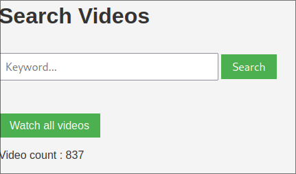

# Video Web Server



This is a simple web server that display video files from a directory and subdirectories.
It also extract thumbnail from the video files and display them in the web page.

It is written in Python using the Flask framework.

## Installation

```bash
python -m venv venv
source venv/bin/activate
pip install -r requirements.txt
```

## Usage

```bash
source venv/bin/activate
python index.py
```

Optionally, you can specify the directory where the video files are located:

```bash
python index.py /path/to/video/files
```

